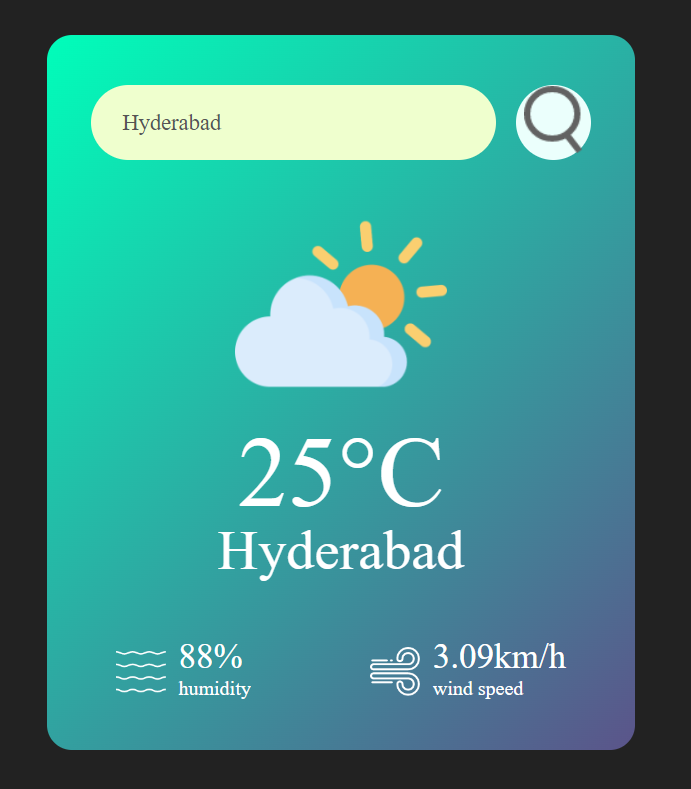

# Weather Forcast Application
This is a simple weather application that allows users to search for and view the current weather conditions of any city. The application fetches real-time weather data from the OpenWeatherMap API and displays it in a user-friendly interface.
## Screenshots
### Homepage

## Files

### `index.html`
- **Description**: Contains the HTML structure for the weather application. It includes elements such as the search input, weather display card, and script for fetching and displaying weather data.
- **Key Features**:
  - Input field to enter city names.
  - Display area for weather details like temperature, city name, humidity, and wind speed.
  - Uses OpenWeatherMap API to fetch weather data.

### `style.css`
- **Description**: Provides the CSS styles for the weather application. It ensures that the app has a clean and modern look.
- **Key Features**:
  - Responsive design for different screen sizes.
  - Styling for the weather card, search box, and weather details.
  - Uses a gradient background and custom fonts for a polished appearance.

## How to Use

1. Open `index.html` in a web browser.
2. Enter the name of the city in the search box.
3. Click the search button to view the current weather conditions for the specified city.

## Dependencies

- [OpenWeatherMap API](https://openweathermap.org/api) for fetching weather data.

## License

This project is open-source and available under the [MIT License](LICENSE).

